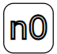

.. |hash| image::  _static/hash.png
   :width: 20px
   :height: 20px
   :align: middle

Установление связи с квартирой  
==================================

На клавиатуре домофона нажмите |aster| , затем наберите номер квартиры.  

.. note:: Максимальная продолжительность звонка домофона составляет 60 секунд. Если ответа абонента не будет в течение 60-ти секунд, произойдет «сброс» вызова.

Если при наборе допущена ошибка, нажмите |hash| и повторите набор. При нажатии |hash| производится полный «сброс» номера.

Если номер квартиры набран неправильно, или трубка отсутствует/неисправна, на дисплее высвечивается сигнал |no|, затем звучит звуковой сигнал. 

Для вызова консьержа нажмите |c|.