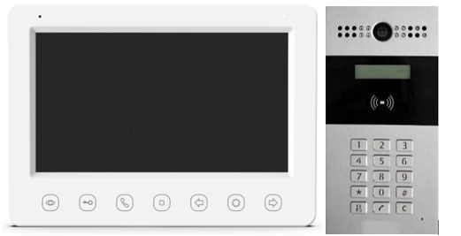

Описание
=============
**ДОМОФОН ZOOM 2100** 

|is2|      

Домофон ZOOM 2100 предназначен для осуществления двусторонней аудио/видео связи с посетителями без физического взаимодействия. 
Комплект домофона состоит из вызывной панели и видеодомофона. Благодаря простоте установки и удобству использования комплект находит широкое применение в жилых зданиях в качестве средства повышения безопасности жильцов.

Функциональные особенности
==============================

**Видеодомофон**
   * Видеосвязь
   * Поддержка мониторинга камеры вызывной панели и внешних аналоговых камер
   * Удаленное отпирание двери
 

**Вызывная панель**
   * Видеосвязь
   * Адаптивная ИК-подсветка 
   * Вызов одним нажатием
   * Встроенная камера с разрешением 720 x 576 @ 25 к/с
   * Контроль отпирания двери
   * Антиокислительный алюминиевый сплав
   
