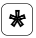
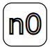

Открытие двери
==================

**Открытие с помощью PIN-кода** 

Пользователи могут использовать персональные коды чтобы открыть дверь. 
Для разблокировки дверей наберите нажмите |aster| и наберите код – дверь разблокируется и появится сообщение
**«ДВЕРЬ ОТКРЫТА»**. 
Если пользователь введет неправильный код, на экране появится сигнал |no|.
 

**Открытие с помощью электронного ключа**

Приложите предварительно
добавленный электронный ключ к домофонному считывателю для открытия
двери – дверь разблокируется и вы увидите надпись и появится сообщение
**«ДВЕРЬ ОТКРЫТА»**.