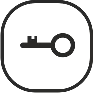

Принятие вызова
======================================

Когда посетитель нажимает кнопку вызова на вызывной панели, изображение посетителя автоматически появляется на мониторе.  

Нажмите кнопку |phone|, чтобы поговорить с посетителем, или |sq|, чтобы отменить вызов.

В момент разговора с посетителем можно открыть дверь, для этого нажмите кнопку |key|, на экране появится надпись **«ДВЕРЬ ОТКРЫТА»**.

.. note:: Дверь остается открытой в течение 5 секунд после нажатия на |key|.